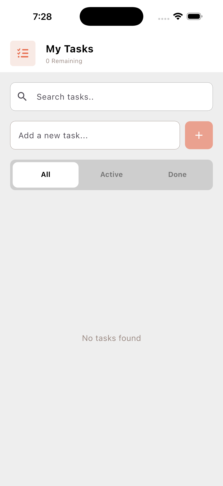
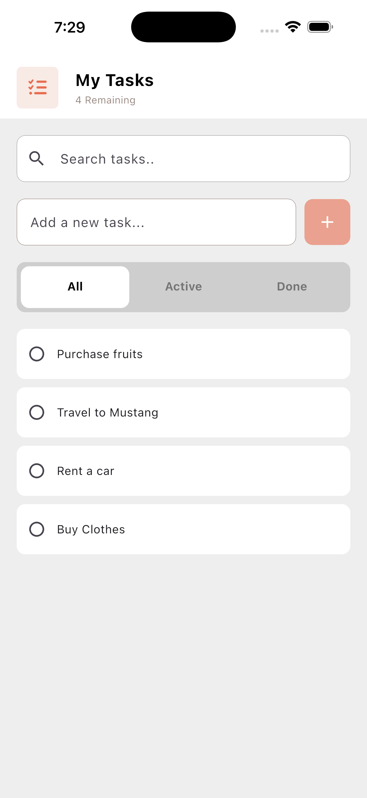
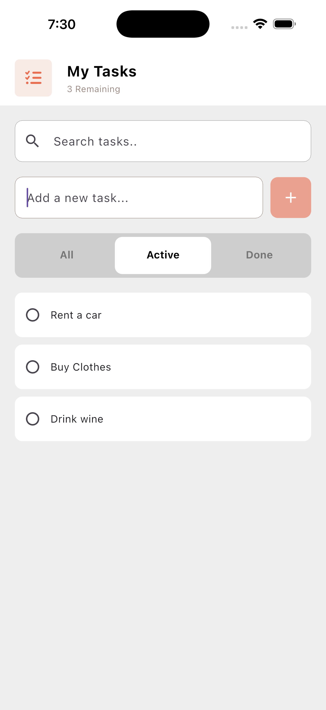
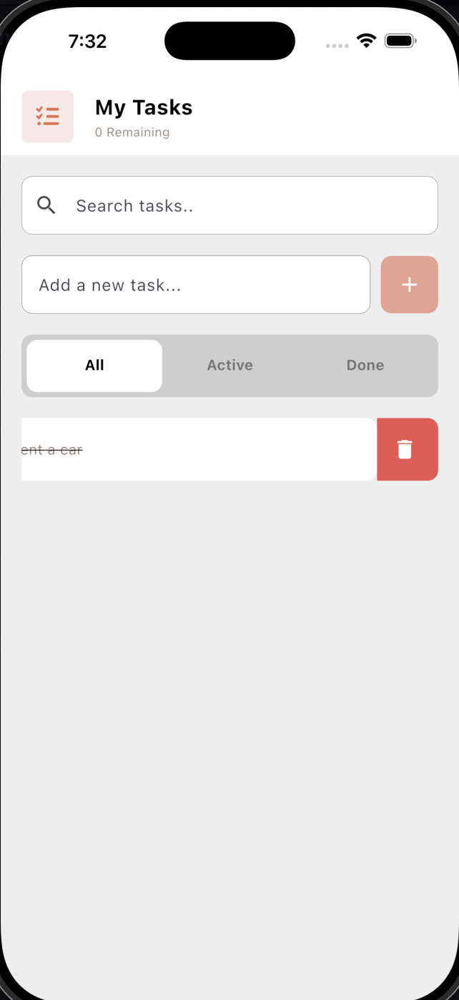
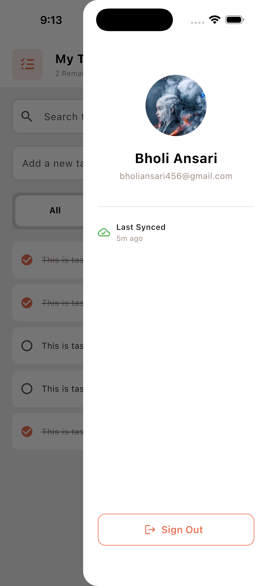
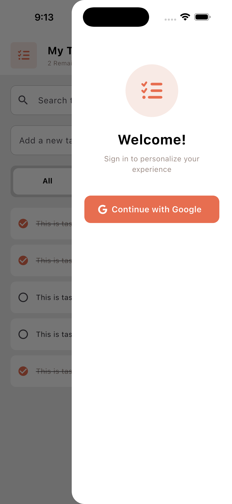

# Todo App - Flutter + Riverpod

A clean, minimal task management app built with **Flutter** and **Riverpod v3** for state management. Features **Google Sign-In**, **Cloud Firestore** sync for logged-in users, offline-first **SQLite** storage, real-time search, tab-based filtering, swipe-to-delete, and toast notifications.

## Screenshots

<p align="center">
  
  &nbsp;&nbsp;
  
  &nbsp;&nbsp;
  
</p>

<p align="center">
  
  &nbsp;&nbsp;
  
  &nbsp;&nbsp;
  
</p>

<p align="center">
  
  &nbsp;&nbsp;
  
</p>

> **Note:** Add your screenshots to the `screenshots/` folder with the names above.

## Features

- **Google Sign-In** — authenticate with your Google account via Firebase Auth
- **Cloud Sync** — todos sync to Cloud Firestore when signed in, accessible across devices
- **Offline-First** — todos stored locally in SQLite when signed out; seamless transition on login/logout
- **Smart Sync** — local todos upload to Firestore on first sign-in; cached todos are not re-uploaded
- **Last Sync Indicator** — profile drawer shows when data was last synced with Firestore
- **Add Tasks** — type and tap the add button or press enter
- **Complete Tasks** — tap the circular checkbox to mark done (with strikethrough)
- **Delete Tasks** — swipe left to dismiss
- **Search** — real-time filtering across all tasks
- **Tab Filtering** — switch between All, Active, and Done views
- **Live Counter** — app bar shows remaining incomplete tasks
- **Profile Drawer** — shows user avatar, name, email, and sync status when logged in
- **Toast Notifications** — feedback on add, delete, and empty input via Cherry Toast

## Tech Stack

| Layer | Tool |
|---|---|
| Framework | Flutter 3.x |
| State Management | Riverpod v3 (`AsyncNotifier` + `Provider`) |
| Authentication | Firebase Auth + Google Sign-In |
| Cloud Database | Cloud Firestore |
| Local Database | sqflite (SQLite) |
| Icons | Font Awesome Flutter |
| Notifications | Cherry Toast |

## Project Structure

```
lib/
 ├── main.dart                  # App entry point (Firebase init + ProviderScope)
 ├── firebase_options.dart      # Generated FlutterFire config
 ├── constants/
 │   └── colors.dart            # App color palette
 ├── model/
 │   └── todo_model.dart        # Todo data model (SQLite + Firestore serialization)
 ├── provider/
 │   ├── auth_provider.dart     # Firebase Auth + Google Sign-In notifier
 │   └── todo_provider.dart     # DatabaseHelper, FirestoreHelper, TodoNotifier
 └── screens/
     ├── home_screen.dart       # Main UI (search, tabs, task list)
     └── profile_drawer.dart    # Profile drawer with sync status
```

## State Management Architecture

```
         Google Sign-In
               │
               ▼
     authProvider (AsyncNotifier<User?>)
               │
               ▼
todoProvider (AsyncNotifier<List<TodoModel>>)
 │                    │
 │  [Logged out]      │  [Logged in]
 │  SQLite ◄──────────┼──────────► Firestore
 │                    │            users/{uid}/todos/
 │                    ▼
 ├── filteredTodosProvider ──── search filter applied
 │    ├── activeTodosProvider ── isCompleted == false
 │    └── doneTodosProvider ──── isCompleted == true
 ├── remainingCountProvider ─── incomplete task count
 ├── lastSyncProvider ───────── last Firestore sync time
 └── searchQueryProvider ────── current search text
```

## Sync Flow

| Event | Behavior |
|---|---|
| **Logged out** | All CRUD operations go to local SQLite |
| **Sign in** | New local todos (no `firestoreId`) upload to Firestore; cached todos are skipped; local DB cleared; data loaded from Firestore |
| **Logged in** | All CRUD operations go directly to Firestore |
| **Sign out** | Current Firestore todos cached to SQLite (with `firestoreId`) so they remain visible offline |

## Database Schema

**SQLite (local)**
```sql
CREATE TABLE todos(
  id INTEGER PRIMARY KEY AUTOINCREMENT,
  title TEXT NOT NULL,
  isCompleted INTEGER NOT NULL DEFAULT 0,
  firestoreId TEXT
)
```

**Firestore (cloud)** — `users/{uid}/todos/{auto-id}`
```
{
  "title": "Buy groceries",
  "isCompleted": false
}
```

## Getting Started

### Prerequisites

- Flutter SDK `^3.10.7`
- A Firebase project with **Authentication** (Google provider) and **Cloud Firestore** enabled
- `google-services.json` (Android) and `GoogleService-Info.plist` (iOS) in the correct locations

### Installation

```bash
# Clone the repository
git clone https://github.com/Bholi/Todo-App-With-Riverpod-State-Management.git
cd Todo-App-With-Riverpod-State-Management

# Install dependencies
flutter pub get

# Run the app
flutter run
```

### Firebase Setup

1. Create a Firebase project at [console.firebase.google.com](https://console.firebase.google.com)
2. Enable **Google Sign-In** under Authentication > Sign-in method
3. Create a **Cloud Firestore** database (start in test mode for development)
4. Add your Android SHA-1 fingerprint to the Firebase project settings
5. Download and place config files:
   - `android/app/google-services.json`
   - `ios/Runner/GoogleService-Info.plist`
6. Add the reversed client ID to `ios/Runner/Info.plist` under `CFBundleURLSchemes`

## Dependencies

```yaml
flutter_riverpod: ^3.2.1
riverpod: ^3.2.1
firebase_core: ^3.13.0
firebase_auth: ^5.5.1
cloud_firestore: ^5.6.5
google_sign_in: ^6.2.2
sqflite: ^2.4.2
path: ^1.9.0
font_awesome_flutter: ^10.12.0
cherry_toast: ^1.13.0
dio: ^5.9.1
```

## License

This project is for learning and practice purposes.
